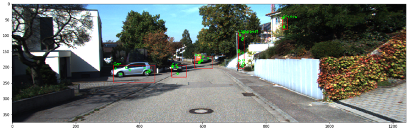

# KB-74-portfolio

*Portfolio voor de minor Applied Data Science (KB-74).*

**Naam:** Isa Isaku  
**Studentnummer:** 14149486  
**Datum:** 13-02-2018

## Inhoudsopgave

[1. Individueel werk](#1-individueel-werk)  
&nbsp;&nbsp;&nbsp;&nbsp;&nbsp;&nbsp;[1.1 Datacamp](#11-datacamp)  
&nbsp;&nbsp;&nbsp;&nbsp;&nbsp;&nbsp;[1.2 Coursera](#12-coursera)  
&nbsp;&nbsp;&nbsp;&nbsp;&nbsp;&nbsp;[1.3 Workshops](#13-workshops)  
&nbsp;&nbsp;&nbsp;&nbsp;&nbsp;&nbsp;&nbsp;&nbsp;&nbsp;&nbsp;&nbsp;&nbsp;[1.3.1 SCRUM-workshop](#131-scrum-workshop)  
&nbsp;&nbsp;&nbsp;&nbsp;&nbsp;&nbsp;&nbsp;&nbsp;&nbsp;&nbsp;&nbsp;&nbsp;[1.3.2 JupyterHub tutorials](#132-jupyterhub-tutorials)  
&nbsp;&nbsp;&nbsp;&nbsp;&nbsp;&nbsp;&nbsp;&nbsp;&nbsp;&nbsp;&nbsp;&nbsp;[1.3.3 Calling bullshit](#133-calling-bullshit)  
[2. Projectwerk](#2-projectwerk)  
&nbsp;&nbsp;&nbsp;&nbsp;&nbsp;&nbsp;[2.1 Projectmatige taken](#21-projectmatige-taken)  
&nbsp;&nbsp;&nbsp;&nbsp;&nbsp;&nbsp;[2.2 Inhoudelijke taken](#22-inhoudelijke-taken)  
&nbsp;&nbsp;&nbsp;&nbsp;&nbsp;&nbsp;&nbsp;&nbsp;&nbsp;&nbsp;&nbsp;&nbsp;[Taak 4 - Literatuur Scan: LSD-SLAM](#taak-4---literatuur-scan-lsd-slam)  
&nbsp;&nbsp;&nbsp;&nbsp;&nbsp;&nbsp;&nbsp;&nbsp;&nbsp;&nbsp;&nbsp;&nbsp;[Taak 23 - Werking LSD SLAM algoritme begrijpen](#taak-23---werking-lsd-slam-algoritme-begrijpen)  
&nbsp;&nbsp;&nbsp;&nbsp;&nbsp;&nbsp;&nbsp;&nbsp;&nbsp;&nbsp;&nbsp;&nbsp;[Taak 27 - SVO Paper bestuderen](#taak-27---svo-paper-bestuderen)  
&nbsp;&nbsp;&nbsp;&nbsp;&nbsp;&nbsp;&nbsp;&nbsp;&nbsp;&nbsp;&nbsp;&nbsp;[Taak 53 - Github repo maken voor eigen ORB2 branch](#taak-53---github-repo-maken-voor-eigen-orb2-branch)  
&nbsp;&nbsp;&nbsp;&nbsp;&nbsp;&nbsp;&nbsp;&nbsp;&nbsp;&nbsp;&nbsp;&nbsp;[Taak 55 - Object detection papers lezen](#taak-55---object-detection-papers-lezen)  
&nbsp;&nbsp;&nbsp;&nbsp;&nbsp;&nbsp;&nbsp;&nbsp;&nbsp;&nbsp;&nbsp;&nbsp;[Taak 63 - Evaluatie: aanpak pointcloud vs pointcloud](#taak-63---evaluatie-aanpak-pointcloud-vs-pointcloud)  
&nbsp;&nbsp;&nbsp;&nbsp;&nbsp;&nbsp;&nbsp;&nbsp;&nbsp;&nbsp;&nbsp;&nbsp;[Taak 64 - Evaluatie implementatie: pointcloud vs pointcloud](#taak-64---evaluatie-implementatie-pointcloud-vs-pointcloud)  
&nbsp;&nbsp;&nbsp;&nbsp;&nbsp;&nbsp;&nbsp;&nbsp;&nbsp;&nbsp;&nbsp;&nbsp;[Taak 94 - Dieptebeeld genereren slinger](#taak-94---dieptebeeld-genereren-slinger)  
&nbsp;&nbsp;&nbsp;&nbsp;&nbsp;&nbsp;&nbsp;&nbsp;&nbsp;&nbsp;&nbsp;&nbsp;[Taak 101 - Opnemen van beeldmateriaal in de hhs](#taak-101---opnemen-van-beeldmateriaal-in-de-hhs)  
&nbsp;&nbsp;&nbsp;&nbsp;&nbsp;&nbsp;&nbsp;&nbsp;&nbsp;&nbsp;&nbsp;&nbsp;[Taak 103 - Beeldmateriaal van slinger en rugzak omzetten voor orb slam 2](#taak-103---beeldmateriaal-van-slinger-en-rugzak-omzetten-voor-orb-slam-2)  
&nbsp;&nbsp;&nbsp;&nbsp;&nbsp;&nbsp;&nbsp;&nbsp;&nbsp;&nbsp;&nbsp;&nbsp;[Taak 104 - Opnemen beeldmateriaal van ovaal en buiten](#taak-104---opnemen-beeldmateriaal-van-ovaal-en-buiten)  
&nbsp;&nbsp;&nbsp;&nbsp;&nbsp;&nbsp;&nbsp;&nbsp;&nbsp;&nbsp;&nbsp;&nbsp;[Taak 108 - URB: Tracking](#taak-108---urb-tracking)  
&nbsp;&nbsp;&nbsp;&nbsp;&nbsp;&nbsp;&nbsp;&nbsp;&nbsp;&nbsp;&nbsp;&nbsp;[Taak 109 - URB: ORB2 in Python](#taak-109---urb-orb2-in-python)  
&nbsp;&nbsp;&nbsp;&nbsp;&nbsp;&nbsp;&nbsp;&nbsp;&nbsp;&nbsp;&nbsp;&nbsp;[Taak 140 - URB uitbreiden](#taak-140---urb-uitbreiden)  
&nbsp;&nbsp;&nbsp;&nbsp;&nbsp;&nbsp;&nbsp;&nbsp;&nbsp;&nbsp;&nbsp;&nbsp;[Taak 142 - Run URB over dataset delft #141](#taak-142---run-urb-over-dataset-delft-141)  
&nbsp;&nbsp;&nbsp;&nbsp;&nbsp;&nbsp;&nbsp;&nbsp;&nbsp;&nbsp;&nbsp;&nbsp;[Taak 152 - 1. Introduction](#taak-152---1-introduction)  
&nbsp;&nbsp;&nbsp;&nbsp;&nbsp;&nbsp;&nbsp;&nbsp;&nbsp;&nbsp;&nbsp;&nbsp;[Taak 153 - 2. Related Work](#taak-153---2-related-work)

## 1. Individueel werk

Binnen de minor heb ik aangeleverde lesstof en opdrachten op o.a. DataCamp, Coursera en de JupyterHub doorlopen. In dit hoofdstuk is het bewijs hiervoor te vinden.

### 1.1 Datacamp

Op DataCamp heb ik alle verplichte onderdelen gevolgd. In de map [DataCamp](DataCamp "DataCamp") is het bewijsmateriaal te vinden. Niet alle verplichte onderdelen staan in het overzicht van voltooide opdrachten. Vandaar dat ik een extra afbeelding ter aanvulling heb toegevoegd.

### 1.2 Coursera

Op Coursera heb ik alle verplichte onderdelen doorlopen. In de map [Coursera](Coursera "Coursera") is het bewijsmateriaal te vinden.

### 1.3 Workshops

Naast het online lesmateriaal hebben we ook allerlei workshops gehad over onderwerpen gerelateerd aan data science.

#### 1.3.1 SCRUM-workshop

Voor het onderzoek binnen de minor is gebruikgemaakt van de SCRUM-methodiek. Daarom hebben we in week 1 een workshop gehad over SCRUM. Bij deze workshop waren wat opdrachten die ik uitgewerkt heb in een [document](Workshops/SCRUM-workshop.pdf "document").

#### 1.3.2 JupyterHub tutorials

Op de JupyterHub van de minor heb ik de tutorials over Spark en Exploratory Data Analysis afgerond. Hieronder zijn referenties naar de notebooks te vinden.

##### Exploratory Data Analysis tutorial

* [1 Checking Data Edges](Workshops/JupyterHub%20tutorials/Exploratory%20Data%20Analysis%20tutorial/1+Checking+Data+Edges.md "1 Checking Data Edges")
* [2 Identifying variables](Workshops/JupyterHub%20tutorials/Exploratory%20Data%20Analysis%20tutorial/2+Identifying+variables.md "2 Identifying variables")
* [3 Univariate Analysis](Workshops/JupyterHub%20tutorials/Exploratory%20Data%20Analysis%20tutorial/3+Univariate+Analysis/3+Univariate+Analysis.md "3 Univariate Analysis")
* [4 Bivariate Analysis](Workshops/JupyterHub%20tutorials/Exploratory%20Data%20Analysis%20tutorial/4+Bivariate+Analysis/4+Bivariate+Analysis.md "4 Bivariate Analysis")
* [5 Missing Values](Workshops/JupyterHub%20tutorials/Exploratory%20Data%20Analysis%20tutorial/5+Missing+Values.md "5 Missing Values")
* [6 Outliers](Workshops/JupyterHub%20tutorials/Exploratory%20Data%20Analysis%20tutorial/6+Outliers/6+Outliers.md "6 Outliers")
* [7 Data Transformation](Workshops/JupyterHub%20tutorials/Exploratory%20Data%20Analysis%20tutorial/7+Data+Transformation/7+Data+Transformation.md "7 Data Transformation")
* [8 Creating Variables](Workshops/JupyterHub%20tutorials/Exploratory%20Data%20Analysis%20tutorial/8+Creating+Variables.md "8 Creating Variables")
* [9 Evaluate](Workshops/JupyterHub%20tutorials/Exploratory%20Data%20Analysis%20tutorial/9+Evaluate.md "9 Evaluate")

##### Spark tutorial

* [Assignment 1](Workshops/JupyterHub%20tutorials/Spark%20tutorial/assignment1.md "Assignment 1")
* [Assignment 2](Workshops/JupyterHub%20tutorials/Spark%20tutorial/assignment2.md "Assignment 2")

#### 1.3.3 Calling bullshit

De [Calling bullshit opdracht](Workshops/Calling%20bullshit%20opdracht.pdf "Calling bullshit opdracht") heb ik afgerond.

## 2. Projectwerk

Binnen de minor heb ik met een projectgroep onderzoek gedaan naar het maken van een semantische map van stedelijke omgevingen ten behoeve van autonoom rijden. In dit hoofdstuk zal ik ingaan op mijn werkzaamheden binnen dit onderzoek.

### 2.1 Projectmatige taken

De volgende presentaties zijn o.a. door mij gecreëerd en gepresenteerd:

* [Presentatie week 6](Presentaties/Presentatie%20week%206.pdf "Presentatie week 6")
* [Presentatie week 15](Presentaties/Presentatie%20week%2015.pdf "Presentatie week 15")
* [Presentatie week 16](Presentaties/Presentatie%20week%2016.pdf "Presentatie week 16")

Verder heb ik [notulen](Notulen/Urbinn%20-%20Sprint%20Retrospective%20(22-12-2017%20-%20Sprint%208).pdf "notulen") opgesteld voor de Sprint Retrospective van sprint 8 en geholpen bij het maken van de [eindpresentatie](Presentaties/Eindpresentatie.pdf "eindpresentatie").

### 2.2 Inhoudelijke taken

Binnen het onderzoek heb ik een bijdrage geleverd aan verschillende taken. Hieronder geef ik per taak aan wat mijn bijdrage is geweest.

#### Taak 4 - Literatuur Scan: LSD-SLAM

Al vrij snel in het onderzoek kwam LSD-SLAM ter sprake als een potentieel algoritme voor het gedeeltelijk opstellen van een semantische kaart. Om meer te kennis te krijgen over SLAM-algoritmes en specifiek LSD-SLAM, heb ik samen met Nektarios informatiemateriaal, zoals papers, op internet gezocht en doorgenomen. Ook heb ik met anderen van de groep die zich in het onderwerp verdiept hebben, gesproken om een beter begrip te krijgen. Uiteindelijk hebben we het informatiemateriaal in de map [LSD-SLAM informatiemateriaal](LSD-SLAM%20informatiemateriaal "LSD-SLAM informatiemateriaal") weten te verzamelen.

#### Taak 23 - Werking LSD SLAM algoritme begrijpen

Er is bij taak 4 veel informatiemateriaal over LSD-SLAM gevonden. Voor deze taak ben ik samen met Nektarios en Jeroen dieper ingegaan op de werking van LSD-SLAM. Uiteindelijk hebben we een overzichtelijke [samenvatting](Taken/Taak%204%20-%20LSD-SLAM.pdf "samenvatting") gemaakt voor de rest van de groep.

#### Taak 27 - SVO Paper bestuderen

Een ander potentieel algoritme voor een semantische kaart was SVO. Samen met Daniëllo heb ik de [paper](SVO%20informatiemateriaal/SVO_Visual_Odometry.pdf "paper") over SVO bestudeerd en de werking van het algoritme samengevat. De [samenvatting](Taken/Taak%2027%20-%20SVO.pdf "samenvatting") was opgesteld om binnen de groep een beter beeld te krijgen van het algoritme.

#### Taak 53 - Github repo maken voor eigen ORB2 branch

ORB2 bleek na enig literatuuronderzoek een goede kandidaat te zijn voor het opstellen van een semantische kaart. Het SLAM-alogirtme is open-source beschikbaar en om verder inzicht te krijgen of het algoritme binnen ons onderzoek bruikbaar was, moesten we de code kunnen bewerken. Vandaar dat ik en wat andere teamgenoten voor deze taak uiteindelijk een eigen [repository](https://github.com/urbinn/orb2 "repository") hebben gemaakt op GitHub die geforked is van de repository [ORB_SLAM2](https://github.com/Alkaid-Benetnash/ORB_SLAM2 "ORB_SLAM2") van Alkaid-Benetnash. Het vergde nog enig werk om de ORB2 software aan de praat te krijgen op de server.

#### Taak 55 - Object detection papers lezen

Na een zekere mate van progressie op het gebied van SLAM-algoritmes zijn we de focus gaan leggen op een ander belangrijk onderdeel voor het opstellen van een semantische kaart, namelijk objectdetectie. Allereerst is er gekeken naar bestaande objectdectie algoritmes. Er zijn verschillende papers gevonden waarvan er twee veelbelovend waren. Deze [papers](Objectdetectie%20informatiemateriaal "papers") hebben we allemaal grondig doorgelezen en besproken tijdens een 'Close Reading'-sessie.

#### Taak 63 - Evaluatie: aanpak pointcloud vs pointcloud

Op een gegeven moment zijn we steeds meer experimenten gaan uitvoeren met SLAM-setups, zoals ORB2, en kwam er behoefte om op formele wijze de kwaliteit van een point cloud (een ruimte met 3D-coördinaten) vast te stellen. De point cloud vormt namelijk een belangrijk onderdeel van onze semantische kaart en heeft daarom grote invloed op de kwaliteit ervan. Binnen deze taak hebben Bob en ik een [evaluatieplan](Taken/Taak%2063%20-%20Evaluatieplan%20point%20cloud.pdf "evaluatieplan") voor point clouds opgesteld.

#### Taak 64 - Evaluatie implementatie: pointcloud vs pointcloud

Voor deze taak hebben Jeroen, Jeffrey, Viradj en ik het evaluatieplan geprobeerd te implementeren. In het evaluatieplan was al beschreven met welke metrics en welke tool de point clouds vergeleken dienen te worden. De uitdaging lag bij het verkrijgen van een goede ground truth point cloud. We hebben naar drie verschillende manieren gekeken om een ground truth op te stellen van de omgeving, namelijk op basis van:

* LIDAR-data
* Dieptebeeld
* ZED mesh generatie

##### LIDAR-DATA

Allereerst hebben Jeroen, Jeffrey en ik gekeken naar LIDAR-data, omdat de KITTI-dataset dit o.a. als ground truth aanbiedt en binnen de minor mogelijkheden waren om aan een LIDAR te komen. Het probleem was dat er per frame een point cloud van de LIDAR was in de KITTI-dataset. Deze moesten samengevoegd worden tot één point cloud, zodat het gebruikt kon worden om te evalueren. Dit bleek niet zo eenvoudig te zijn, omdat point clouds van opvolgende frames een verschuiving hebben, zoals te zien is in de afbeelding hieronder.

 In een notebook, dat helaas per ongeluk verwijderd is door Jeroen, hebben we geprobeerd dit te doen met behulp van pose informatie afkomstig van de KITTI-dataset. Helaas zijn we er na lang proberen niet in geslaagd om dat voor elkaar te krijgen, waardoor deze aanpak ook niet gebruikt kon worden voor eigen opnames in bijvoorbeeld Delft.

Als gevolg van deze uitkomst hebben Jeffrey en ik gekeken naar een per frame evaluatie aanpak met behulp van het nearest neighbour algoritme. Hiervoor hebben we een test gemaakt in een [notebook](Taken/Taak%2064%20-%20Notebooks/keyframe_conversion.md "notebook"). Helaas kwamen we er al snel achter dat de LIDAR minder ver 3D-punten vind dan een visueel SLAM-algoritme voor hetzelfde opnamemoment. Bovendien bleek na een tijdje dat de beschikbare LIDAR voor deze minor niet goed genoeg was, waardoor deze optie definitief afviel.

##### Dieptebeeld

 Het volgende waarnaar we gekeken hebben is het opstellen van een ground truth met behulp van dieptebeelden. Hiervoor hebben we een tool gebruikt die beschikbaar is voor de ZED-camera en een klein [experiment](Taken/Taak%2064%20-%20Notebooks/depth_map.md "experiment") opgezet. Het gegenereerde dieptebeeld bleek altijd relatief te zijn binnen een frame. Daarnaast was het dieptebeeld niet nauwkeurig genoeg, omdat het sommige vlakken niet herkende. We zijn tot de conclusie gekomen dat deze optie ook niet ging werken.

##### ZED mesh generatie

Een andere tool voor de ZED-camera is ZEDfu die een 3D mesh, een soort point cloud zoals te zien is in de afbeelding hieronder, genereert aan de hand van een SLAM algoritme. Ik en Viradj zijn met deze tool aan de slag gegaan om te kijken of het bruikbaar was. Hiervoor hebben we beeldmateriaal van de gangen van de Slinger gebruikt. Uiteindelijk bleek dat deze tool te onnauwkeurig was, omdat het geen loop closing functionaliteit bevatte, drift vertoonde in opnames en niet goed met reflectie omging bij de bepaling van diepte.

Nadat alle mogelijkheden afvielen, hebben we besloten dat het formeel evalueren van een point cloud niet gaat lukken met de middelen en kennis die wij hebben. Vandaar dat we besloten hebben dit voorlopig op informele basis te zullen gaan evalueren.

#### Taak 94 - Dieptebeeld genereren slinger

Deze taak is al beschreven bij taak 64 onder het kopje 'Dieptebeeld'.

#### Taak 101 - Opnemen van beeldmateriaal in de hhs

Voor deze taak hebben Viradj en ik allereerst de opname setup met de ZED-camera klaargezet. Hiervoor moesten we o.a. de SDK van ZED installeren wat best veel werk heeft gekost ondanks de extra hulp van Jeffrey. Verder hebben we de type opnames vastgesteld aan de hand van de doeleinden van het beeldmateriaal en vervolgens hebben we de opnames binnen het gebouw van de hhs gemaakt.

#### Taak 103 - Beeldmateriaal van slinger en rugzak omzetten voor orb slam 2

Om het opgenomen beeldmateriaal in taak 101 door de SLAM-algoritmes te laten verwerken, hebben we de output van de ZED-camera (svo-bestand) met behulp van de ZED SDK export functionaliteiten omgezet naar een avi-bestand. Vervolgens hebben we met de tool ffmpeg voor linux dit avi-bestand omgezet in png-bestanden.

#### Taak 104 - Opnemen beeldmateriaal van ovaal en buiten

Voor deze taak heb ik met Viradj vastgesteld welke opnames met de ZED-camera gemaakt moeten worden aan de hand van de doeleinden van het beeldmateriaal.

#### Taak 108 - URB: Tracking

Er is op een gegeven moment besloten dat we onze eigen variant van ORB-SLAM2, genaamd URB, gingen bouwen in Python. Voor deze taak hebben Jeroen, Jeffrey en ik gewerkt aan de URB-implementatie van het tracking gedeelte van ORB-SLAM2.

Allereerst hebben we gekeken naar het extraheren van orbs uit een linker en rechter frame die afkomstig zijn van een stereo camera. Hiervoor hebben we de library OpenCV gebruikt. Vervolgens hebben we op dezelfde wijze als ORB-SLAM2 geprobeerd orbs uit het linker frame te matchen aan gelijke orbs in het rechter frame, ook wel stereo matching genoemd. Net als in ORB-SLAM2 is hiervoor gebruikgemaakt van subpixel matching, een techniek waardoor de verplaatsing van een orb tussen linker en rechter frame op subpixel niveau kan worden uitgedrukt, zodat uiteindelijk de diepte van een plek in de wereld zo nauwkeurig mogelijk kan worden berekend.

Met behulp van stereo beelden van de KITTI-dataset hebben we informele experimenten uitgevoerd om te kijken hoe goed de diepte wordt berekend. De resultaten van de berekeningen zagen er goed uit, maar er zat wel veel ruis tussen. Het bleek dat ORB-SLAM2 nauwelijks controleert of orbs uit linker en rechter frames goed matchen. Daarom hebben we gekozen voor een andere aanpak om stereo matching uit te voeren. In deze aanpak worden alleen orbs geëxtraheerd uit het linker frame. Vervolgens wordt er een patch van 17x17 pixels gepakt rond deze orbs en wordt zo'n patch op gelijke hoogte in het rechter frame horizontaal naar links verplaatst om te kijken waar deze het best overeenkomt. Deze manier kan toegepast worden, omdat de afbeeldingen rectified zijn. Door weer gebruik te maken van subpixel matching, kan de diepte weer nauwkeurig worden berekend.

Ondanks deze aanpassingen bleek er nog steeds te veel ruis te zijn. We waren op een gegeven moment op het idee gekomen om gebruik te maken van een vertical 'canny edge' filter om alleen de begin- en eindpunten van verticale lijnen te gebruiken als orbs. Na wat experimenteren bleek dit inderdaad aardig te werken.

Een ander belangrijk onderdeel binnen het tracking gedeelte, waaraan ik heb meegewerkt, is het uitvoeren van motion-only bundle adjustment om camera poses te berekenen. ORB-SLAM2 maakt hiervoor gebruik van g2o, een C++ library die bundle adjustment functionaliteiten biedt. Om in URB ook hiervan gebruik te kunnen maken, hebben we zogenaamde Python hooks moeten maken om de C++ code in deze library aan te roepen vanuit Python. Dit hebben we kunnen bereiken met behulp van de library Boost Python. Daarnaast hebben we de code van g2o moeten uitbreiden om specifiek motion-only bundle adjustment te kunnen gebruiken. Dit was goed te doen, omdat we de code van ORB-SLAM2 als referentie konden gebruiken.

De tracking code die binnen deze taak is neergezet, is uiteindelijk terechtgekomen in het opgeleverde eindprodcuct.

#### Taak 109 - URB: ORB2 in Python

Taak 109 was de overkoepelende taak voor het implementeren van URB. Voor deze taak heb ik samen met Jeffrey een git-repository opgezet voor URB, waarin gebruikgemaakt wordt van Docker om cross-platform URB te kunnen draaien. Ook hebben we gekeken naar de structuur die de applicatie moest gaan krijgen. Dit was nodig omdat we tot nu toe alles in notebooks hebben ontwikkeld en het overzicht van de code steeds slechter werd. We wilden een OOP-structuur opzetten om meer overzicht te creëren en afstappen van de notebooks om de overdraagbaarheid van de applicatie te verbeteren. Hiervoor hebben we eerst [de structuur van de code in de notebooks](Taken/Taak%20109%20-%20Ontwerpen/Klassendiagram%20oude%20situatie.png "de structuur van de code in de notebooks") in kaart gebracht en vervolgens zijn we met behulp van een [componentdiagram](Taken/Taak%20109%20-%20Ontwerpen/Componentdiagram.png "componentdiagram") en [klassendiagram](Taken/Taak%20109%20-%20Ontwerpen/Klassendiagram%20nieuwe%20situatie.png "klassendiagram") een nieuwe structuur gaan ontwerpen voor het proof of concept. In verband met tijdgebrek is in de groep besloten om vast te houden aan de notebooks en de code hierin een beetje beter te structureren. Vandaar dat het klassendiagram niet is afgemaakt.

#### Taak 140 - URB uitbreiden

In deze taak heb ik Jeffrey een beetje geholpen om YOLO te kopppelen aan URB, zodat we kunnen aanduiden welke orbs bij een bepaald object horen, zoals te zien is hieronder.

Ik heb geholpen bij het uitlezen en verwerken van de JSON-file die YOLO als output geeft en dat als input dient voor URB. Uiteindelijk hebben we het voor elkaar gekregen om een 2D-semantische kaart uit URB te halen.

#### Taak 142 - Run URB over dataset delft #141

Er zijn in Delft opnames gemaakt om experimenten uit te voeren met SLAM- en objectdetectie algoritmes. Voor deze taak heb ik in samenwerking met Viradj geprobeerd deze opnames met verschillende framerates door urb te laten verwerken. Urb bleek echter te instabiel en crashte om de haverklap. We hebben de foutmeldingen in kaart gebracht en getracht de problemen op te lossen. Dit is echter niet gelukt, omdat de code in de notebooks onoverzichtelijk en slecht gedocumenteerd is.

#### Taak 152 - 1. Introduction

In een vergadering hebben we de plannen besproken voor het op te leveren paper dat gaat over onze vernieuwingen aan het orginele ORB2-algoritme. Voor deze taak hebben ik en wat andere groepsgenoten de introductie van het [paper](Taken/Taak%20152%20&%20153%20-%20Paper/Paper.pdf "paper") geschreven.

#### Taak 153 - 2. Related Work

Voor deze taak heb ik samen met Viradj een bijdrage geleverd aan het hoofdstuk 'Related work' van het [paper](Taken/Taak%20152%20&%20153%20-%20Paper/Paper.pdf "paper"), namelijk het stuk tekst over SLAM.
